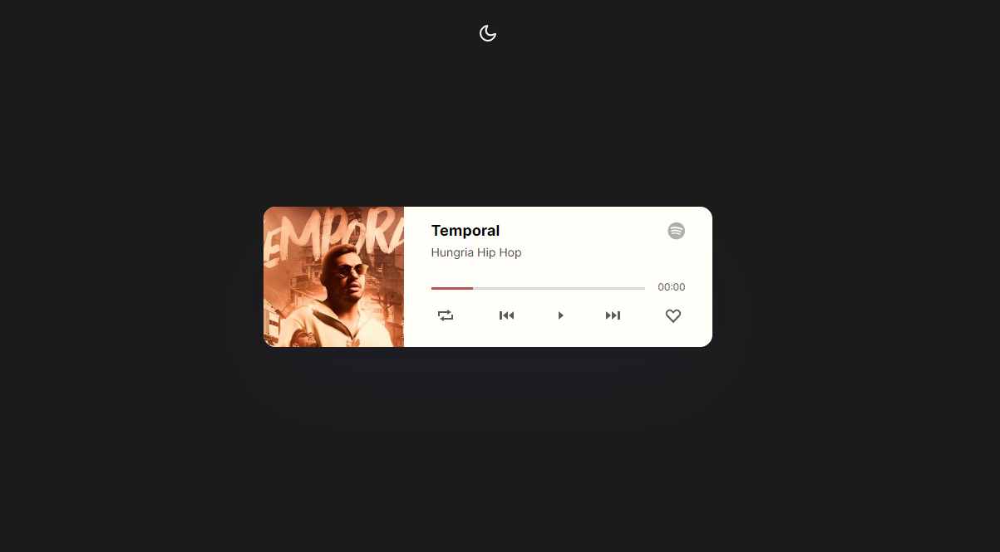

<h1 align="center"> Projeto Music Player  </h1>

Criado para treinar as habilidades nas tecnologias abaixo, futuramente o mesmo sera atualizado.  

  <a href="#-tecnologias">Tecnologias</a>&nbsp;&nbsp;&nbsp;|&nbsp;&nbsp;&nbsp;
  <a href="#-projeto">Projeto</a>&nbsp;&nbsp;&nbsp;

  

 

  

## 🚀 Tecnologias

Esse projeto foi desenvolvido com as seguintes tecnologias:

- HTML e CSS
- JavaScript
- Git e Github
- Figma

## 📸 Demonstração

Cliquei aqui para ver a [Demo](https://eduardof3lipe.github.io/MusicPlayerWeb/) do projeto.

